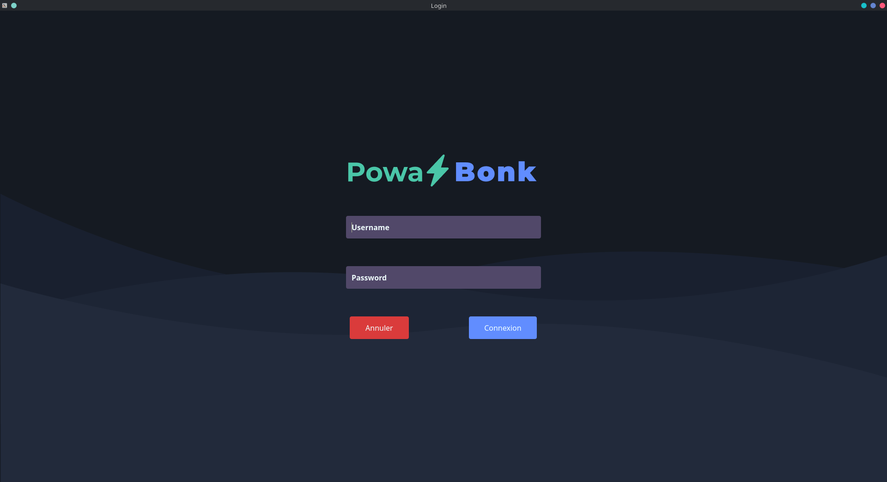

<div id="top"></div>

<!-- PROJECT SHIELDS -->
<!--
*** I'm using markdown "reference style" links for readability.
*** Reference links are enclosed in brackets [ ] instead of parentheses ( ).
*** See the bottom of this document for the declaration of the reference variables
*** for contributors-url, forks-url, etc. This is an optional, concise syntax 
*** you may use.
*** https://www.markdownguide.org/basic-syntax/#reference-style-links
-->

<!-- PROJECT LOGO -->
<br />
<div align="center">
  <a href="https://github.com/Jaggernaute/PowaBonk">
    
  </a>

<h3 align="center">Powa Bonk</h3>

  <p align="center">
    Powerful system for reserving an electric car charging station.
    <br />
    <a href="https://github.com/Jaggernaute/PowaBonk">
    <strong>Documentation »</strong></a>
    <br />
    <br />
    <a href="https://github.com/Jaggernaute/PowaBonk">Demo</a>
    ·
    <a href="https://github.com/Jaggernaute/PowaBonk/issues">Report bug</a>
    ·
    <a href="https://github.com/Jaggernaute/PowaBonk/issues">Request a feature</a>
  </p>
</div>


<!-- TABLE OF CONTENTS -->
<details>
  <summary>Sommaire :</summary>
  <ol>
    <li>
      <a href="#about-the-project">About the project</a>
      <ul>
        <li><a href="#built-with">Built with</a></li>
      </ul>
    </li>
    <li>
      <a href="#getting-started">Getting started</a>
      <ul>
        <li><a href="#requirements">Requirements</a></li>
        <li><a href="#installation">Installation</a></li>
      </ul>
    </li>
    <li><a href="#usage">USage</a></li>
    <li><a href="#roadmap">Roadmap</a></li>
    <li><a href="#contributing">Contributing</a></li>
    <li><a href="#license">Licence</a></li>
    <li><a href="#contact">Contact</a></li>
    <li><a href="#acknowledgments">Acknowledgments</a></li>
  </ol>
</details>


<!-- ABOUT THE PROJECT -->
## About the project

PowaBonk is a powerful system for reserving an electric car charging station.
This repository is only the user management part of the system.
It's built with [C++](https://en.wikipedia.org/wiki/C%2B%2B) and 
[Qt](https://www.qt.io/),
to be fast and cross-platform.



### Technologies used

* [Qt](https://www.qt.io)
* [CMake](https://cmake.org)
* [ninja](https://ninja-build.org/manual.html#_introduction)
* [gcc](https://gcc.gnu.org)
* [clang](https://clang.llvm.org)

<!-- GETTING STARTED -->
## Getting started

In order to compile and run the application, you need to have the following:

* [Qt](https://www.qt.io)
* [CMake](https://cmake.org)
* [gcc](https://gcc.gnu.org)

### Requirements

List of prerequisites needed to compile and run the application.  
For more information, 
go take a look to the official site of the technology you'll find greater 
details on how to install and run it.

#### Linux
#### Arch Linux:
  ```sh
  pacman -S qt6-base-git
  ```
  [learn more](https://wiki.archlinux.org/title/qt) 

#### Debian/Ubuntu:
  ```sh
  sudo apt-get build-dep qtbase5-dev libxcb
  sudo apt-get install cmake ninja-build clang build-essential libb2-dev libzstd-dev \
    libsystemd-dev libhunspell-dev libclang-10-dev libmng-dev \
    libwebp-dev libdouble-conversion-dev libkrb5-dev libdirectfb-dev libts-dev \
    libproxy-dev libsctp-dev libbrotli-dev
    
  cd ~/Downloads
  wget -c https://download.qt.io/official_releases/qt/6.1/6.1.0/single/qt-everywhere-src-6.1.0.tar.xz
  tar -xf qt-everywhere-src-6.1.0.tar.xz
    
  cd qt-everywhere-src-6.1.0
  ./configure
  cmake --build . --parallel
  ```
[learn more](https://wiki.debian.org/qt)  
[why so complicated](https://askubuntu.com/a/1341877)

### Installation

1. Clone the repository on your machine.
   ```sh
   git clone https://github.com/Jaggernaute/PowaBonk.git
   ```
2. In the `PowaBonk` directory, run CMake :
   ```sh
   cmake CmakeLists.txt
   ```
3. Copile the application with :
   ```js
   make
   ```
   <!-- TODO: add the database / server deployement instructions  and move 
   everything to a DEPLOYEMENT.md-->

<!-- USAGE EXAMPLES -->
## Usage

Use this space to show useful examples of how a project can be used. 
Additional screenshots, code examples and demos work well in this space. 
You may also link to more resources.

_For more examples, please refer to the [Documentation](https://example.com)_

<!-- CONTRIBUTING -->
## Contributing

See the code of conduct 
[here](https://github.com/Jaggernaute/PowaBonk/tree/master/docs/CODE_OF_CONDUCT.md) 
and read the gidelines 
[here](https://www.github.com/Jaggernaute/PowaBonk/tree/master/docs/CONTRIBUTING.md).


<!-- LICENSE -->
## License

Distributed under the GNU License. See `LICENSE.txt` 
(available [here](https://www.github.com/Jaggernaute/PowaBonk/blob/master/LICENSE)) 
for more information.


<!-- ACKNOWLEDGMENTS -->
## Acknowledgments

See all the people that contributed to this project 
[here](https://github.com/Jaggernaute/PowaBonk/tree/master/docs/AUTHORS.md)


<!-- MARKDOWN LINKS & IMAGES -->
<!-- https://www.markdownguide.org/basic-syntax/#reference-style-links -->
[contributors-shield]: https://img.shields.io/github/contributors/Jaggernaute/PowaBonk.svg?style=for-the-badge
[contributors-url]: https://github.com/Jaggernaute/PowaBonk/graphs/contributors
[forks-shield]: https://img.shields.io/github/forks/Jaggernaute/PowaBonk.svg?style=for-the-badge
[forks-url]: https://github.com/Jaggernaute/PowaBonk/network/members
[stars-shield]: https://img.shields.io/github/stars/Jaggernaute/PowaBonk.svg?style=for-the-badge
[stars-url]: https://github.com/Jaggernaute/PowaBonk/stargazers
[issues-shield]: https://img.shields.io/github/issues/Jaggernaute/PowaBonk.svg?style=for-the-badge
[issues-url]: https://github.com/Jaggernaute/PowaBonk/issues
[license-shield]: https://img.shields.io/github/license/Jaggernaute/PowaBonk.svg?style=for-the-badge
[license-url]: https://github.com/Jaggernaute/PowaBonk/blob/master/LICENSE.txt
[linkedin-shield]: https://img.shields.io/badge/-LinkedIn-black.svg?style=for-the-badge&logo=linkedin&colorB=555
[linkedin-url]: https://linkedin.com/in/ 
[product-screenshot]: images/screenshot.png